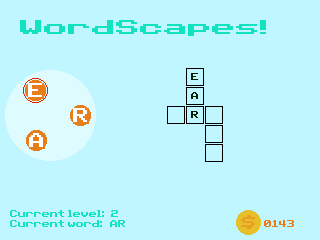

# Wordscapes CE
This is a port of wordscapes for the TI-84 Plus CE. A game where you select letters on the D-Pad (letter wheel) to form words and complete the crossword.

There are no valid words when using the same letter on the D-Pad twice. You get *X* coins when you solve a word with *X* letters. There are 25 levels, and your save file is in the AppVar "WDSCSAVE"

## Instructions
Use the 'right' and 'left' arrow keys to move your selected letter around on the D-Pad, and press the '2nd' key to append that letter to the end of the current word. Once you are finished your word, press the 'enter' key and see if it's in the crossword. You can also use the 'enter' key to clear the selected word if you made a typo or believe it's the wrong answer. To exit the program, press the 'clear' key.

